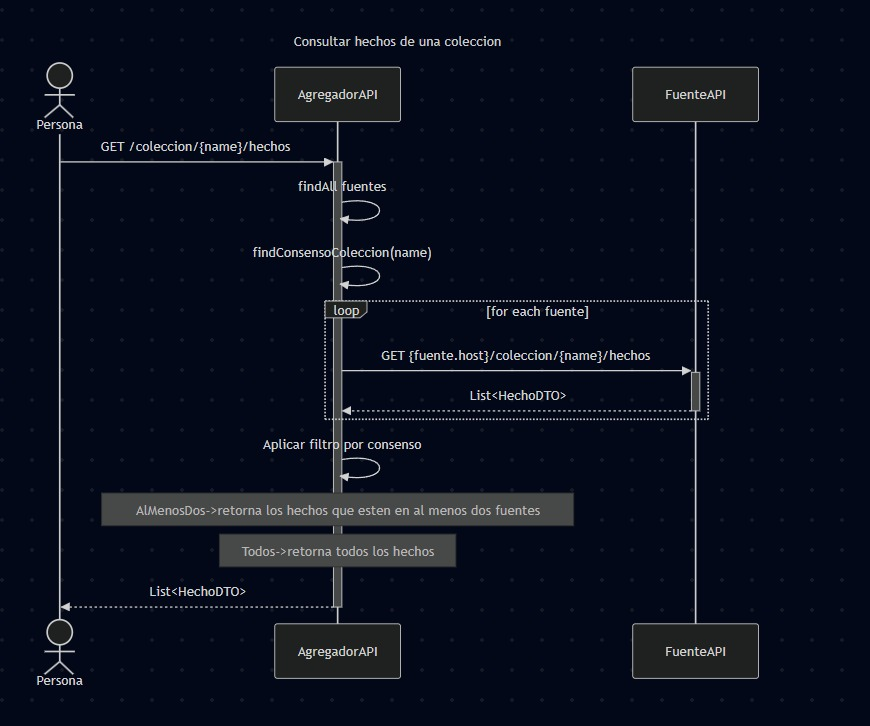
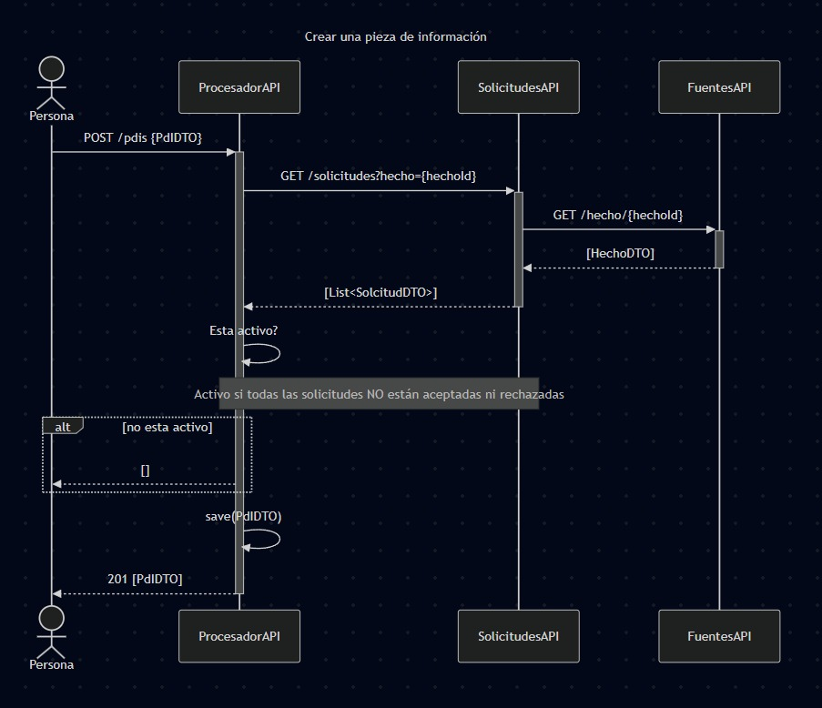
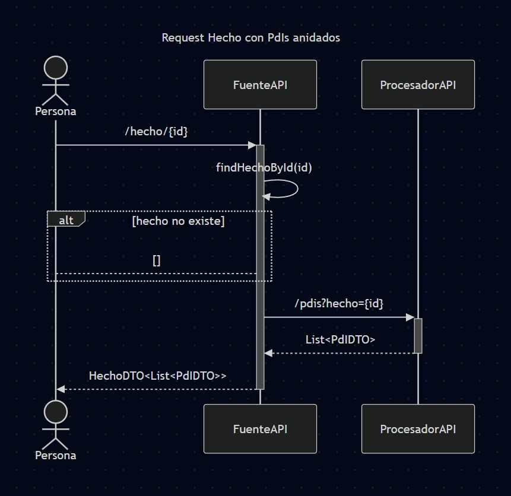

# Grupo 6 - Procesador

| Nombre            | Componente     | Repositorio                                                                 | Render                                                                   |
|-------------------|----------------|-----------------------------------------------------------------------------|--------------------------------------------------------------------------|
| Franco di Nápoli  | Fuentes        | [Repo Fuentes](https://github.com/FrancoAdN/tp-dds-fuentes)                 | [Render Fuentes](https://tp-dds-fuentes.onrender.com/)                   |
| Sebastián Balás   | Procesador PDI | [Repo Procesador PDI](https://github.com/Sebabalas/2025-tp-anual-Sebabalas) | [Render Procesador PDI](https://two025-tp-anual-sebabalas.onrender.com/) | 
| Agustina Righetti | Solicitudes    | [Repo Solicitudes](https://github.com/Agus-Righetti/DdSTPSolicitudes2025)   | [Render Solicitudes](https://ddstp2025.onrender.com)                     |
|                   | Agregador      | [Repo Agregador](https://github.com/Agus-Righetti/DdSTPAgregador2025)       | [Render Agregador]()                                                     |

- [Datadog](https://app.datadoghq.com/help/quick_start)
---

## Enunciados
[Contexto](https://docs.google.com/document/d/15gXE5rFl9H0y3p8g8IoyuX8dCnQ9_0LZ2UgJFOROAvo/edit?tab=t.0)  
[Entrega 1](https://docs.google.com/document/d/1NZXyArrTiWjNHKGKDeHRVKB71l_s14ZiMCfsH3xLkb0/edit?tab=t.0)  
[Entrega 2](https://docs.google.com/document/d/1ztJBBVzDKqn37Jj_TkSnr07S4ghAfePI29kS2lSvAtc/edit?tab=t.0)  
[Entrega 3](https://docs.google.com/document/d/1AUvymkzZTCIYqJInmEa6-gPbt344DjffRZe2HP0qye8/edit?tab=t.0)

## Casos de uso

### Consultar hechos de una colección

### Crear una pieza de información (PDI)

### Request Hecho con PDIs anidados
